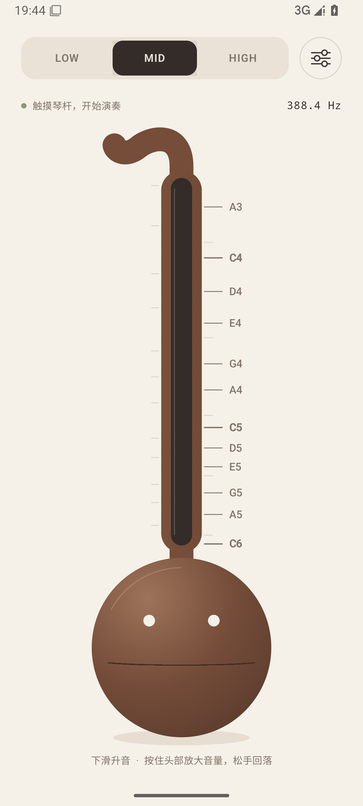
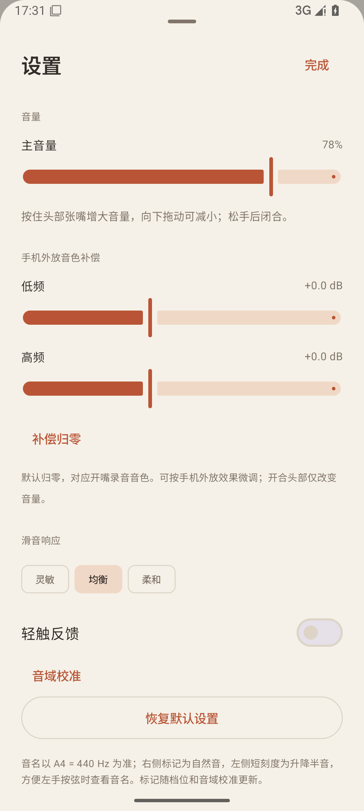

# Otamatone · 电音蝌蚪

一个使用 **Kotlin + Jetpack Compose** 开发的 Android 电子蝌蚪琴模拟器。通过连续滑弦和双指控制，在手机上演奏接近实物的电子音色。

[下载 1.0.0 APK](https://github.com/turtleSST/Otamatone/raw/refs/heads/master/releases/1.0.0/ElectronicTadpole-1.0.0-release.apk) · [安装包校验](releases/1.0.0/SHA256SUMS.txt) · [GPL-3.0](LICENSE)

**Android 8.0+ · 完全离线 · 无广告 · 无需运行权限**

<p>
  
  
</p>

## 功能

- **连续音高**：琴杆上端低音、下端高音，支持滑音和手动颤音，不吸附音阶。
- **三档音域**：LOW、MID、HIGH 分别采用实录标定的音色与音域，保留不同音高的谐波和响度特征。
- **独立双指控制**：一根手指按弦，另一根按住头部张嘴增大音量；向下拖动头部可减小音量，松手闭合。
- **音准指引**：音名位于琴杆右侧，方便左手按弦；演奏时显示音名、频率和音分偏差。
- **演奏设置**：主音量、低频/高频补偿、滑音响应、触觉反馈，以及各档独立的三点音域校准。
- **实时合成**：使用带限波表和 AudioTrack 输出，不循环播放录音；进入后台或失去音频焦点后停止声音。

## 安装

下载 [Release APK](https://github.com/turtleSST/Otamatone/raw/refs/heads/master/releases/1.0.0/ElectronicTadpole-1.0.0-release.apk) 后在 Android 手机上安装。当前版本为 **1.0.0**，安装包约 **1.26 MB**，最低支持 Android 8.0（API 26）。

安装包与 SHA-256 校验文件位于 [`releases/1.0.0/`](releases/1.0.0)。签名证书指纹见 [`docs/signing-certificate.sha256`](docs/signing-certificate.sha256)。

如果设备上已有其他签名的同包名应用，需要先备份设置并卸载冲突版本；卸载会清除该应用的本地设置。更多信息见 [构建与发布说明](docs/release.md)。

## 演奏方式

| 操作 | 效果 |
|---|---|
| 按住琴杆黑条 | 发声，松手停止 |
| 沿琴杆向下 / 向上滑动 | 升高 / 降低音高 |
| 小幅上下摆动 | 手动颤音 |
| 按住头部 | 张嘴，平滑增大音量 |
| 按着头部向下拖动 | 减小嘴部开度和音量 |
| 切换 LOW / MID / HIGH | 切换音色与音域，音名标记同步更新 |
| 长按设置图标 | 查看音频诊断信息 |

右侧音名采用 **A4 = 440 Hz**，数字表示八度；左侧细刻度为升降半音。标记位置根据当前档位和校准曲线计算，小屏幕会自动减少文字密度。

| 档位 | 最低音 | 最高音 |
|---|---:|---:|
| LOW | 54.49 Hz | 292.18 Hz |
| MID | 203.79 Hz | 1057.64 Hz |
| HIGH | 806.26 Hz | 4443.68 Hz |

## 从源码构建

需要 JDK **17 或 21**、Android SDK Platform **35** 与 Build Tools **35.0.0**。工程使用 Gradle Wrapper，无需单独安装 Gradle 或 NDK。

```bash
git clone https://github.com/turtleSST/Otamatone.git
cd Otamatone
./gradlew :app:assembleDebug
```

Windows 使用 `gradlew.bat`。也可以在 Android Studio 中打开项目根目录，并将 Gradle JDK 设置为兼容版本。

Debug APK 输出到 `app/build/outputs/apk/debug/app-debug.apk`。普通构建不需要签名私钥、Python 或原始录音。

```bash
./gradlew :app:test :app:lint
```

连接测试设备后可运行 `:app:connectedDebugAndroidTest`。正式签名、独立 Release 验证和交付打包见 [发布说明](docs/release.md)。

## 项目结构

| 路径 | 内容 |
|---|---|
| `app/` | Android 应用、实时音频引擎与自动化测试 |
| `release-check/` | 针对已签名 Release APK 的独立验证工具 |
| `audio-analysis/` | 音色分析脚本、公开模型和 Kotlin 数据生成器 |
| `scripts/` | 签名、验证与打包工具 |
| `docs/` | 技术说明、验证结果和界面截图 |
| `releases/` | 明确选定的正式 APK、版本信息及校验文件 |

生成的音色模型和测试参考数据随源码提供。原始录音、参考照片、逐窗口分析缓存及签名私钥不在公开仓库中；它们不是 Android 构建的必需输入。使用自己的录音重新建模时，请阅读 [音色模型说明](docs/audio-model.md)。

## 更多说明

- [音色模型与复现](docs/audio-model.md)
- [验证结果](docs/verification.md)
- [构建与发布](docs/release.md)
- [更新记录](CHANGELOG.md)
- [贡献指南](CONTRIBUTING.md)

## 许可证

本项目采用 [GNU General Public License v3.0](LICENSE)。第三方依赖遵循各自的许可证。

这是一个非官方模拟项目，与 Otamatone 品牌及其制造商无关联。
